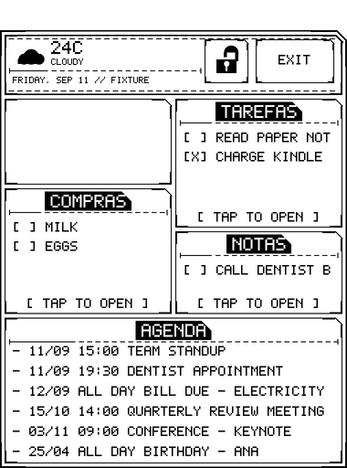
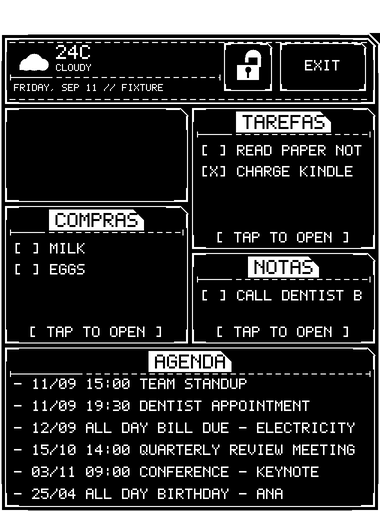
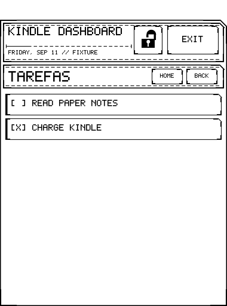

# Kindle Dashboard

**Your Kindle can do way more than be a book reader.**

Turn a jailbroken Kindle into an always-on, e-ink home dashboard: weather,
your calendar, a to-do list, a grocery list and notes, all on one screen.
You update it by texting a Telegram bot ("comprar leite", "reunião amanhã às
14h", or a voice note), and the Kindle redraws within seconds. Tap an item on
the Kindle to tick it off.

<p align="center">
  
  
  
</p>

<sub>Rendered from `kindle/native/fixtures/dashboard-data.json`. The empty
tile top-left is the photo tile; put any picture there.</sub>

## What it does

- **Weather** for your location (Open-Meteo, free, no API key).
- **Agenda** with your next events from any CalDAV calendar (Google, iCloud,
  Nextcloud, Radicale, Home Assistant, ...). Recurring events included.
- **Three lists**: tasks, groceries and notes. Tap a tile to open it
  full-screen, tap an item to mark it done.
- **A Telegram bot** that edits all of the above: a button menu that always
  works, free-text and voice notes when you add an (optional, free-tier) LLM
  key, undo buttons, a daily summary, and exports.
- **Live updates** over SSE: a change from your phone shows up on the Kindle
  in seconds, not minutes.
- **Works offline**: the last payload is cached and redrawn if Wi-Fi drops.
- **Light and dark themes**, a screen lock for when you carry it around, a
  custom header title, and a photo tile for any picture you like.
- **Private by design**: you run your own backend. The bot answers only your
  chat and ignores everyone else.

> **Language:** the bot and the on-screen tile titles are in Brazilian
> Portuguese. The bot also understands English commands.

## What you need

| | Required? | Cost |
| --- | --- | --- |
| A Kindle that can be jailbroken, with [KUAL](https://kindlemodding.org/) installed | Yes | — |
| A computer with Node.js 20+ and npm (macOS or Linux) | Yes | Free |
| An [InsForge](https://insforge.dev) account (database + serverless functions) | Yes | Free tier |
| A Telegram bot, created with [@BotFather](https://t.me/BotFather) | Yes | Free |
| An LLM API key, e.g. [Gemini](https://aistudio.google.com/apikey) | Optional — enables free text and voice | Free tier |
| A CalDAV calendar | Optional — enables the agenda | Usually free |
| [Zig](https://ziglang.org/) or an ARM cross compiler | Only to build the Kindle binary yourself | Free |

Jailbreaking depends on your Kindle model and firmware version, and it is the
one step this project cannot do for you. Start at
[kindlemodding.org](https://kindlemodding.org/) and the
[MobileRead Kindle forum](https://www.mobileread.com/forums/forumdisplay.php?f=150),
and come back once KUAL opens on your device.

## Getting started

1. **[Install guide](docs/INSTALL_FOR_USERS.md)** — backend, Telegram bot,
   building the package, and putting it on the Kindle, step by step.
2. **[Setup with a coding assistant](docs/SETUP_WITH_ASSISTANT.md)** — the
   same steps, as prompts for Claude Code, Codex, Cursor and similar tools.
3. **[Configuration reference](docs/CONFIGURATION.md)** — every setting, on
   the backend and on the Kindle.

The short version, once your Kindle has KUAL:

```sh
git clone <this-repo> kindle-dashboard && cd kindle-dashboard
npm install
npx @insforge/cli login
npx @insforge/cli create --name kindle-dashboard --region us-east --template empty
npm run kit:backend                              # database + secrets + functions
npm run telegram:chat-id -- --bot-token <token>  # after messaging your bot once
npm run telegram:configure -- --bot-token <token> --chat-id <id> \
  --webhook-url https://<your-project>.insforge.app/functions/telegram-webhook
make -C kindle/native extension-zig              # builds the KUAL package
```

Then copy the package to the Kindle, fill in `config.sh`, and start it from
KUAL. The [install guide](docs/INSTALL_FOR_USERS.md) covers each of those in
detail.

## Using it

- **[Telegram bot reference](docs/BOT.md)** — every command, every phrasing
  it understands, every reply it can send.
- **[Kindle-side reference](kindle/README.md)** — KUAL menu, dark mode,
  start-on-boot, logs.

## How it works

```text
Telegram ──▶ telegram-webhook ──▶ Postgres ──▶ kindle-dashboard-data ──▶ Kindle
                  │                   │                    ▲
                  └──▶ CalDAV         └──▶ kindle-dashboard-events (SSE "refetch now")
```

A small native C++ program on the Kindle fetches one JSON payload from your
backend, draws it straight to the e-ink framebuffer, and listens for touch.
Four serverless functions on InsForge serve that payload, push change
notifications, accept taps, and run the Telegram bot.

**[Architecture](docs/ARCHITECTURE.md)** explains the pieces and the
non-obvious decisions behind them.

## Project layout

```text
functions/     InsForge edge functions (Deno): dashboard data, live events, taps, Telegram bot
migrations/    Postgres schema
kindle/native/ C++ renderer + Makefile that builds the KUAL package
kindle/kual/   KUAL extension: menu, launcher scripts, config.sh.example
scripts/       Setup helpers (backend bootstrap, Telegram, Kindle install)
docs/          Guides and references
```

## Credits

This project is based on
[thecodedose/kdashboard](https://github.com/thecodedose/kdashboard), which
created the original bring-your-own-backend Kindle dashboard kit: the native
renderer, the InsForge backend and the KUAL packaging. On top of it, this
version adds, among other things, the
weather/agenda/notes layout, the Portuguese Telegram bot with LLM parsing,
voice notes, undo, daily summaries, dark mode, the screen lock and a
configurable title.
